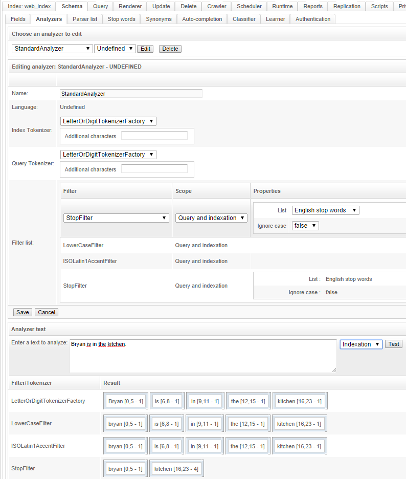
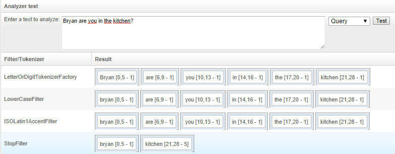

## How to set up stop words

`Stop words` prevent selected words from being indexed. However, OpenSearchServer does not implements it by default.

Using this feature requires:

1. Adding a `StopFilter` to an analyzer
2. Configuring a field to use this analyzer

And that's it! Nothing to it.

### More about analyzers

Analyzers are used to process data either during the indexing process or during the querying process. They can perform numerous roles. Two key roles are splitting sentences in words (or `tokens`) and stemming words, allowing searches to be more efficient.

OpenSearchServer comes with several analyzers, such as `StandardAnalyzer`. It is possible to add a `StopFilter` to this analyzer so that every field using `StandardAnalyzer` will also run the `stop words` feature.

In the example below, a field using the `StandardAnalyzer` enhanced with a `StopFilter` is indexing the sentence `Bryan is in the kitchen`.

The final remaining tokens are `bryan` and `kitchen`. The tokens `is`, `in` and `the` have been removed by the Stop Words feature, since those words are in the default `English stop words` list.

This feature allows for matching a document whose title is `Bryan is in the kitchen` with the search `Bryan are you in the kitchen?`. This is because the final remaining tokens for this query would also be `bryan` and `kitchen`, as shown in this screenshot:

Of course the `Stop words` feature may have other goals, such as preventing the indexation of swear words.

### Managing lists of stop words

Stop words lists are managed within the tab `Schema` / `Stop words`. Each line can only contain one stop word. And that's it, really.
