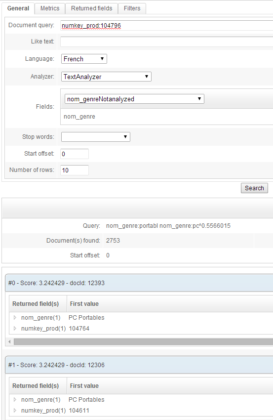

## How to use the More Like This feature

This page explains how to create MoreLikeThis queries. These are used to find documents similar to a given document.
  
A typical use case is a e-commerce or news web site suggesting similar products or content to visitors looking at an article.

First, create a new query in the Query tab. Choose the "More like this" type.

This query's point is to return documents similar to another. This baseline document must be identified in the `Document query` field. Assuming a schema with a field named `product_id`, we could for instance have a query for `product_id:345`. This query must be written in the usual query pattern format.

The field `Like text` must be left empty.

Select the language of your documents in the `Language` list.

Now you must designate the field(s) that will be used to find similarities between documents. This is done in the `Fields` area.

In the `Analyzer` list, pick the same analyzer as used for this field in the index's schema.

`

The second tab allows for the configuration of some metrics. These default values are fine to start with.

At last one returned field must be configured:

Here is another example, where products are identified in a field named `numkey_prod`. Similarity is computed using the field `nom_genre`, which lists product categories.

Of course this query template can be used in an API call, where "Document query" can be easily overiden. Have a look at the [More Like This API section of our documentation](http://www.opensearchserver.com/documentation/api_v2/more-like-this/README.html).
