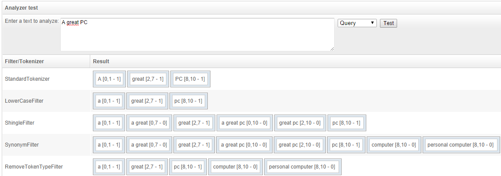
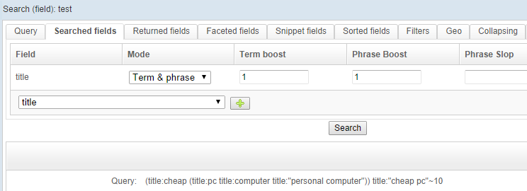

## How to use synonyms

OpenSearchServer offers considerable flexibility when working with synonyms:

* OpenSearchServer handles multiple lists of synonyms. 
* Synonyms can be a single word, or a sequence of words. 
* A given term can have any number of synonyms.
* **Synonyms only get used when querying**, which is particularly handy in practice.

In OpenSearchServer, lists of synonyms are simply created using the `Schema` / `Synonyms` tab. Just write one series of synonyms per line. For instance :

```
pc,computer,personal computer
joystick,gamepad
```

### Configuring schemas to work with synonyms

An index's schema must be configured to make use of these lists of synonyms. This is done with `Analyzers` - by adding a filter to an existing analyzer. Here is an example :


Here are the tokens created by this modified analyzer when querying with the keywords "a great PC":



Here is what is happening, step by step:

1. The tokenizer splits the sentence into tokens.
2. The filter `LowerCaseFilter` transforms every word to lower case.
3. The filter `Shingler filter` creates several groups of tokens. In this example it was configured to produce groups of 1 to 3 words, as you can see in the `Max shingle size` and `Min shingle size` settings in the screenshot. This is because **`Max shingle size` must match the number of words in the longest synonym of the list**. If the longest synonym in the list is "personal computer", a `Max shingle size` of 2 is thus sufficient.
4. The filter `SynonymFilter` detects available synonyms by comparing each token to the list of synonyms. The applicable synonyms are then added to the list of tokens.
5. The filter `RemoveTokenTypeFilter` removes the extra shingles.

The last 3 filters are only applied at query time. **This allows for considerable flexibility**: documents can be indexed first and list of synonyms can be written, modified or expanded later, without having to index the data again.

### Configuring queries to make use of synonyms

Queries must belong to the `Search (field)` type. Searched fields **must use the `Term & Phrase` mode** to properly handle synonyms. Here is an example of a search for "cheap pc" on a field called `title`, using the analyzer from the previous example:



The final query pattern used by OpenSearchServer is `(title:cheap (title:pc title:computer title:"personal computer")) title:"cheap pc"~10`. This is functionally equivalent to **running a cluster of queries in one shot**. The automatic use of the Boolean `OR` operator in this pattern means that the query can be expressed as :

> search for `cheap pc` OR `cheap computer` OR `cheap personal computer` OR `"cheap pc"`. 

And thus, a document titled "A cheap computer" will be found when searching for "cheap pc".
