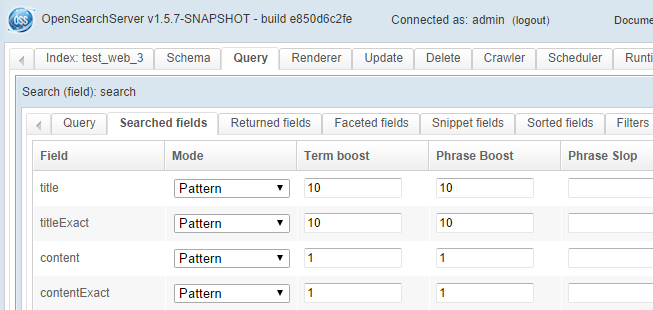
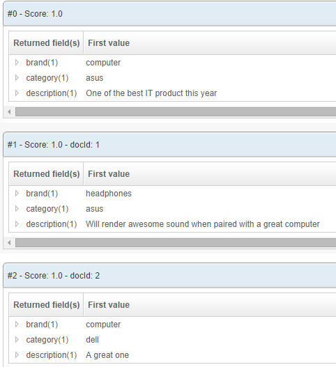
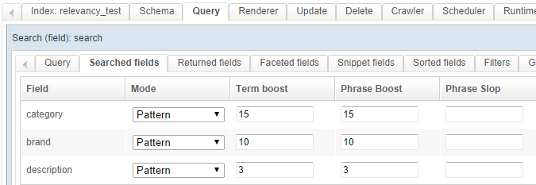
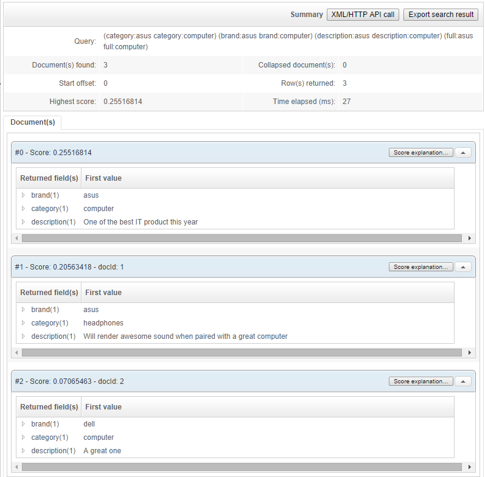
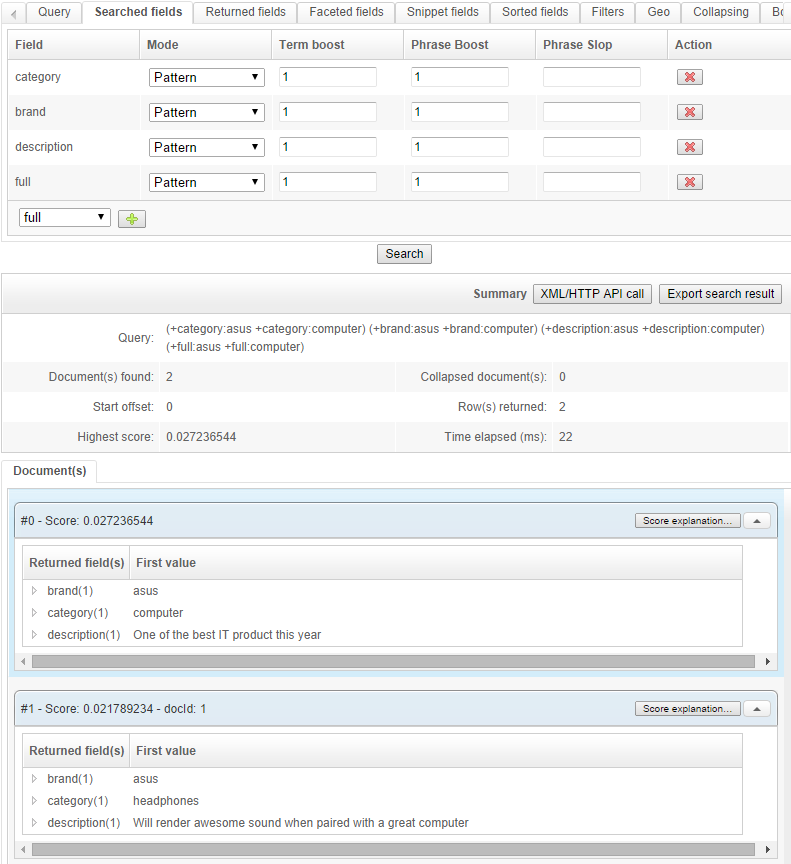
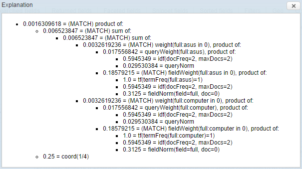
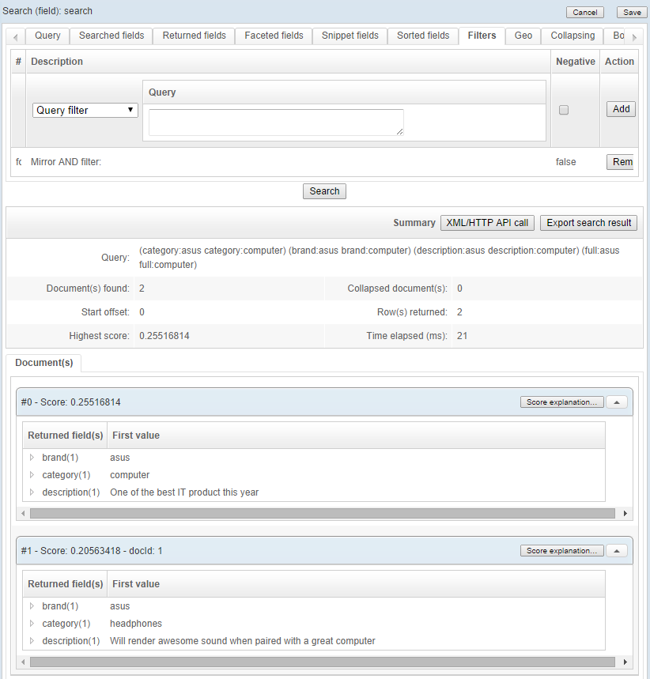

## Improving relevancy with "Mirror AND filter"

When a search query is made, OpenSearchServer finds **documents matching this query** then **computes a score for each document**. This score shows how closely a document matches the query.

For a document to match the query, at least one of its fields must contain at least one of the searched keywords. Those fields wherein the search will take place are the ones configured in the query. Configuration can take place using the tab `Searched fields` for a `Search (field)`.

This is where choosing the `Search operator` becomes important.

* When using a boolean `OR` operator, OpenSearchServer will add a document to its results set as soon as but a single searched keyword is found in one the searched fields.
* When using an `AND` operator, every keywords must be found in one of the searched fields for the document to be added to the results set.

Choosing between `AND` and `OR` depends on the need, but will usually get the job done. However, in some complex cases, these operators can have unwanted effects.

Let's have an example:

* The index's schema has several fields - `category`, `brand`, and `description`.
* The following documents are indexed with these values:
    * Document #1: `category` is "**computer**", `brand` is "**asus**" and `description` is "One of the best IT product this year".
    * Document #2: `category` is "headphones", `brand` is "**asus**" and `description` is "Will render awesome sound when paired with a great **computer**".
    * Document #3: `category` is "**computer**", `brand` is "dell" and `description` is "A great one".
  
_Screenshot of this schema:_

_Screenshot of the documents:_

The first problem that comes to mind is: when searching for "asus computer", if the `AND` operator is used (so as to get documents including both "asus" and "computer") no result will be returned. **There is no field containing both words**. 

_Screenshot of searched fields:_

_Result when searching for "asus computer":_

If the `OR` operator is used instead for the "asus computer" search, **every field having at least one searched keyword is used for computing score**. Which means that documents with only the word "computer" are returned, even if they do not mention "asus". This is probably not a desirable result.

_When searching using an `OR` operator:_

The common solution to this issue is to **create a field called `full`** and to **copy every text value** into it:

Let's re-index the data and add the field `full` to the list of searched fields. Now, 2 documents are returned:

However, **both documents have poor scores**. In spite of the huge boost given to the fields `category` and `brand` in this query, the first document does not stand out compared to the other one. Curses ! Why ?

This is because ** the fields `category` and `brand` have not been used in scoring** by this query. Since those fields do not include **both** searched keywords, OpenSearchServer only used the field `full` for scoring.

_Screenshot of the popup explaining the score (using the button "Score explanation"):_

To bypass this limitation, OpenSearchServer has introduced a new feature with build 1.5-b731. 

It is now possible to **compute scores for documents based on an `OR` operator** yet **filter results like an `AND`** operator would. This is the best of both worlds.

In our example, if **an operator `OR` is used** instead of an `AND` **and the `Mirror AND filter`** is added, the results will look like this:

Only 2 documents are returned (the ones having both searched words), and now the relevance scores are higher and show a bigger difference! This because both the `category` and `brand` fields were used, including the boost value that was assigned to them.

_Explanation of the score for the first result:_

